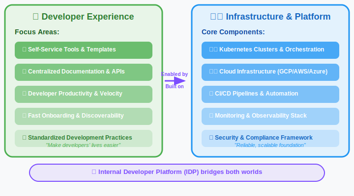
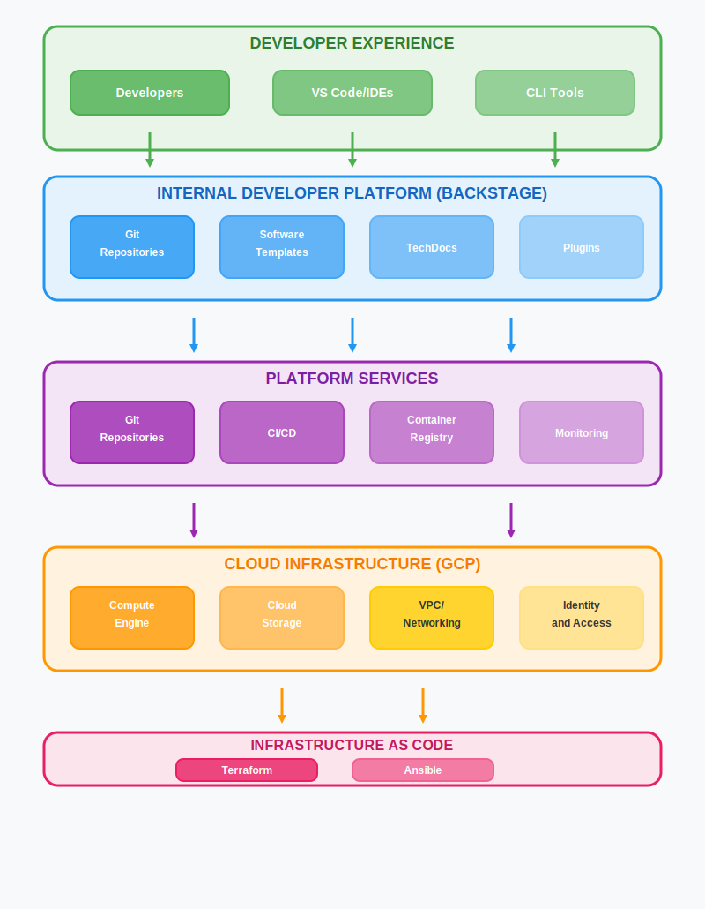
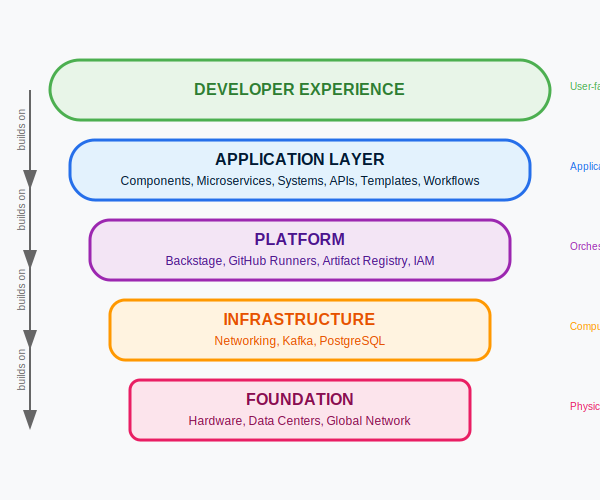

<!-- _class: lead -->

# 🎯 Positioning: Modern DevEx

> DevEx is **not about building infrastructure or platforms for their own sake** —  
> it’s about **reducing cognitive load**,  
> **enabling self-service**, and  
> **boosting productivity & happiness**.

<!--
Vision:

  - Emphasize this is a **vision statement**, not just a definition.  
  - Call out that infra/platform can exist, but they are only **means to an end**.
-->

---

🚀 Modern DevEx — What

- 🧠 **Reduce cognitive load** → maximize developer productivity  
- ⚡ **Enable intuitive, automated, self-service capabilities**  
- 😀 **Let developers focus on code, not infrastructure** 

---

⚙️ Modern DevEx — How

- 🧩 **Make systems understandable**  
  - Clear abstractions & discoverability  
  - Golden paths that guide the "right way"  
  - Visual system maps & ownership clarity  

- ⚡ **Empower self-service**  
  - Developer portals as a single hub  
  - Automation of scaffolding, deployments, environments  
  - Fast feedback loops for instant learning  

- 📊 **Continuously measure & improve**  
  - Time-to-first-PR, onboarding speed, developer satisfaction  

  

---

☁️ How does it connect

---

☁️ How does it relate to other things

  

    
  

  

## DevEx Relationships

<ul>
<li><strong>DevEx</strong> provides developer-friendly abstractions over infrastructure</li>
<li><strong>Platform Engineering</strong> enables DevEx through reliable foundations</li>
<li><strong>Tools & Automation</strong> bridge infrastructure and developer needs</li>
<li><strong>Self-Service</strong> emerges from this layered approach</li>
</ul>

  

---

☁️ What does it mean

---

Modern vs Traditional DevEX Metrics

| **Traditional Metrics** | **Modern DevEx Metrics** |
|------------------------|---------------------------|
| Lines of code | Time to first PR |
| Deployment frequency | Developer satisfaction scores |
| Bug count | Time to resolve blockers |
| System uptime | Onboarding time (days → hours) |
| Code coverage % | Feature delivery velocity |
| Infrastructure costs | Developer productivity index |

**Modern DevEx = Developer-Centric Measurements + Business Impact**

---

🎯 IDP: What is it

- **A centralized hub for all developer tools**, services, ~~documentation~~, and processes related to building and running software.
- *Designed to improve developer experience* by abstracting away complexity and making self-service possible.
- In our case, *built using Backstage*

---

📝 Summary

## What is Developer Experience?

<ul>
<li><strong>Developer productivity</strong> through better tools & processes</li>
<li><strong>Self-service platforms</strong> - reduce waiting & dependencies</li>
<li><strong>Cognitive load reduction</strong> - focus on code, not infrastructure</li>
<li><strong>Fast feedback loops</strong> - instant insights & error detection</li>
<li><strong>Golden path</strong> - opinionated defaults that just work</li>
<li><strong>Accelerated time to market</strong> - faster feature delivery & deployment</li>
</ul>

---

🎯 Modern DevEx — Why

## Our Objectives

- 🚀 **Focus on our core business** — developing game experiences  

- ⚡ **Become faster and more effective** by building less ourselves and increasing use of ready-made standardized services and automation  

- 💖 **Continue to be an attractive employer**  

  

---
<!-- _class: invert -->

# ❓ Questions?

Let’s discuss!
