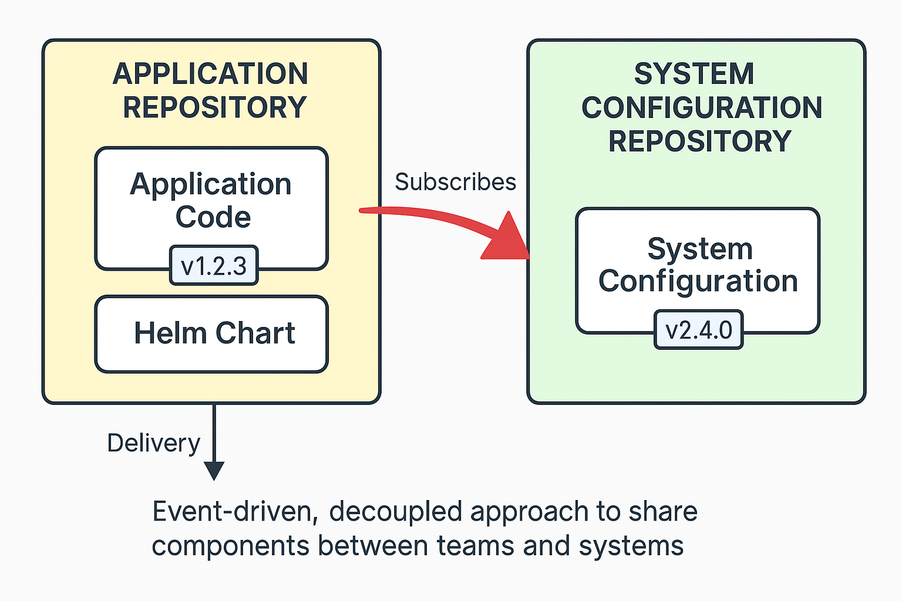
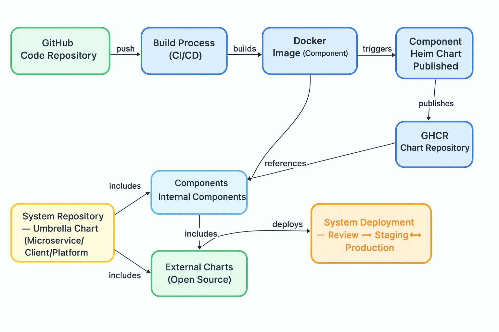

<!-- _class: lead -->

# 🎯 Components, Systems and Promotions

> Packaging is **more than containerizing apps** —  
> it’s about **reusable components**,  
> **system orchestration with umbrella charts**, and  
> **seamless deployment pipelines**.

*The technical foundation of our deployment architecture*

---

🚀 Component vs. System

> - 📦 **Component** → Application packaged as a Docker image in a registry  
> - 📋 **Helm Chart** → Default deployment definition for 
a component  

> - 🏗️ **System** → Umbrella chart combining multiple components into one cohesive unit  
> - 🚀 **Delivery** → We promote systems (not individual components) through review → staging → production

---

📦 Packaging Components

- 🐳 **Docker Image** → Bundles application code + runtime dependencies  
- 📋 **Helm Chart** → Defines how the component is deployed by default  
- 🏷️ **Registry** → Images and charts are published to GHCR for distribution  
- ⚙️ **Default Config** → Includes sensible defaults for resources, limits, and deployment settings  

---

🏗️ Packaging Systems

- 🛠️ **Umbrella Chart** → Orchestrates multiple components into one system  
- 🎯 **Example System Archetypes**:
  - **Microservice** → API + business logic + database  
  - **Client** → Frontend apps with assets + web servers  
  - **Managed Service** → Shared infra like monitoring or authentication  
- 🔗 **Dependencies** → Includes internal charts + external charts  for components
- 🔄 **Promotion** → Entire systems move through environments: review → staging → production  

---

⚡ Helm Application Structure

**Application Structure:**  
How components are organized within Helm charts and umbrella systems  

---

⚡ Helm Deployment Flow

**From Code to Production:**  
The full pipeline — from GitHub → build → packaging → system deployment  

---

❓ Questions

💬 *How does this shape our deployment strategy?*  

