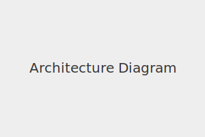

<!-- _class: lead -->

# 🎯 System Architecture Overview

Welcome to the tech walkthrough of our architecture  

---

# ☁️ Cloud Infrastructure

- Hosted on AWS
- Uses Terraform for IaC
- Monitored with Prometheus + Grafana

---

# 📌 Key Components

1. API Gateway
2. Microservices (Go, Rust)
3. PostgreSQL + Redis
4. Kubernetes (EKS)

---

# 📝 Summary

- Scalable and secure
- Observability built-in
- Automated deployment

---

<!-- _class: invert -->

# ❓ Questions?

Let’s discuss!
